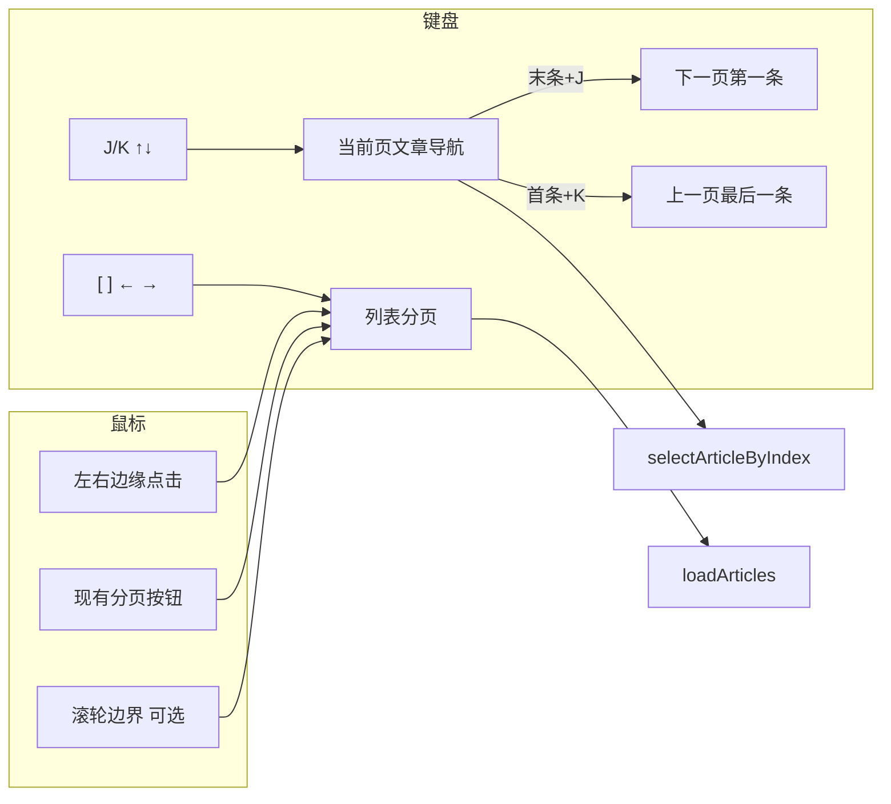

# 文章阅读器翻页与键盘导航

本文档描述 `article-reader.html` 的**列表分页**与**文章导航**交互方案，以及分阶段开发计划。供产品对照与前端实现参考。

**文档版本**：1.0  
**相关文件**：`frontend/article-reader.html`、`frontend/article-reader.js`

---

## 1. 背景与目标

### 1.1 现状

| 能力 | 状态 |
|------|------|
| 列表分页 UI（桌面底栏 + 移动浮动按钮） | 已实现 |
| 分列布局文章选中与详情面板 | 已实现 |
| 键盘翻页 / 文章导航 | **未实现** |
| `keydown` 全局处理 | 仅 `Escape` 关闭菜单 |

分页相关变量（`article-reader.js`）：

- `articleListPage` — 当前页码（从 1 开始）
- `articlePageSize` — 每页条数
- `articleTotalCount` — 筛选条件下文章总数
- `activeArticleIndex` — 当前页内选中文章索引
- `currentArticles` — 当前页文章数组

### 1.2 目标

在**不依赖触摸**的前提下，用户仅用**键盘**或**鼠标**即可完成：

1. **列表分页**：上一页 / 下一页 / 跨页连续浏览
2. **文章导航**：在当前页内上一条 / 下一条移动，分列布局同步详情
3. 与现有 UI（分页按钮、Feed 面板、搜索、弹层）**低冲突、可预期**

### 1.3 非目标（本期）

- 板报布局内的复杂焦点模型（见 §4.4，一期可整块禁用分页快捷键）
- 移动端手势滑动翻页（用户明确要求键盘/鼠标）
- 修改后端分页 API（复用现有 `limit` / `offset`）

---

## 2. 概念分层

「翻页」在阅读器中有两层含义，需分开设计：

| 层级 | 含义 | 现有能力 | 快捷键命名空间 |
|------|------|----------|----------------|
| **列表分页** | 第 1 页 ↔ 第 2 页… | 分页栏、`loadArticles()` | `[` `]`、`←` `→`（翻页语义） |
| **文章导航** | 当前页内上/下一条 | 点击选中、`selectArticleByIndex()` | `J` `K`、`↑` `↓` |

---

## 3. 交互方案

### 3.1 键盘快捷键（P0）

沿用 RSS 阅读器常见习惯（Google Reader / Feedly / Reeder）：

| 按键 | 行为 | 说明 |
|------|------|------|
| `J` / `↓` | 下一条文章 | 列表内移动选中；分列布局同步更新右侧详情 |
| `K` / `↑` | 上一条文章 | 同上 |
| `Enter` / `O` | 打开当前文章 | 分列：确保选中并滚入视口；仅标题：展开；有原文 URL 时可新窗口打开（见实现细则） |
| `[` / `←` | 上一页（列表分页） | 调用 `articleListPage -= 1` 后 `loadArticles()` |
| `]` / `→` | 下一页（列表分页） | 调用 `articleListPage += 1` 后 `loadArticles()` |
| `Home` / `End` | 当前页首条 / 末条 | 快速定位 |
| `/` | 聚焦搜索框 | 聚焦后禁用 §3.3 所列快捷键 |
| `?` | 显示快捷键帮助 | P2，可选浮层 |
| `Esc` | 关闭弹层 | **已有**，保持不变 |

#### 跨页自动衔接（核心体验）

```
当前页最后一条 + J/↓  →  若存在下一页：articleListPage++，加载后选中第一条
当前页第一条 + K/↑    →  若存在上一页：articleListPage--，加载后选中最后一条
已在末页最后一条 / 首页第一条 → 无操作（可选轻提示）
```

实现时 `loadArticles()` 需支持选项，例如 `{ selectAfterLoad: 'first' | 'last' | index }`，避免翻页后丢失选中态。

#### 分列 / 分列+原文布局补充（P1）

| 场景 | 建议 |
|------|------|
| 详情区（非 iframe）滚动未到底 | `Space` = 向下滚动一屏；`Shift+Space` = 向上 |
| 详情区滚到底 | `J` / `Space`（可选）→ 下一条 |
| `columns-iframe` 原文 iframe 获焦 | 快捷键不拦截；提示「按 Esc 回到列表」或提供「回到列表」按钮 |

`Space` **仅在详情面板获焦时**生效，列表区不用 `Space` 翻页，避免与页面滚动冲突。

### 3.2 鼠标交互

#### 3.2.1 列表左右边缘点击区（P1，推荐）

```
┌─────────────────────────────────────┐
│ ← 8%  │      文章列表主体区        │  8% → │
│ 上一页 │                             │ 下一页 │
└─────────────────────────────────────┘
```

- 左/右各约 **8%** 宽度透明热区，垂直覆盖列表可视区域
- 悬停显示淡色箭头；首次使用可 toast：「点击左右边缘翻页」
- 点击 = 上一页 / 下一页（与分页按钮逻辑一致）
- 热区不覆盖单行文章点击区域的核心部分，降低与「点标题展开/选中」冲突

#### 3.2.2 现有分页按钮（保持不变）

- 桌面：底部分页栏
- 移动：右下角可拖动浮动按钮组

#### 3.2.3 滚轮边界翻页（P2，默认关闭）

- 列表滚到底 + 继续向下滚 → 下一页
- 滚到顶 + 继续向上滚 → 上一页
- 建议放在布局菜单：**「滚轮边界翻页」**，默认关

#### 3.2.4 鼠标侧键（P2，可选）

- `button 3`（后退键）→ 上一页
- `button 4`（前进键）→ 下一页

### 3.3 快捷键禁用条件

以下情况**不处理**导航快捷键（让浏览器/控件默认行为生效）：

| 条件 | 说明 |
|------|------|
| 焦点在 `input` / `textarea` / `select` | 含搜索框、页码跳转、每页条数 |
| 搜索弹层、布局菜单、右键菜单、板报定制面板打开 | 与 `Escape` 关闭逻辑一致 |
| 板报布局 `layout-bulletin` | 无列表分页；P0 可整块禁用 `[` `]` 与边缘点击 |
| `columns-iframe` 且焦点在 iframe 内 | 不抢 iframe 内滚动与选择 |
| 未选择 Feed / 分组、文章总数为 0 | 无分页目标 |
| 正在 `loadArticles` 加载中 | 防抖，避免连按重复请求 |

### 3.4 板报布局

板报模式隐藏分页栏（`is-bulletin-layout`），语义不同：

- **不建议**列表式左右翻页
- P0：禁用 `[` `]` 与边缘点击翻页
- P2（可选）：`J/K` 在单卡片文章间移动，需单独设计焦点模型

### 3.5 不建议的做法

| 方案 | 原因 |
|------|------|
| 单独用 `←/→` 仅翻页、不与文章导航共用 | 与 Feed 面板宽度调整（分隔条 `ArrowLeft/Right`）冲突；若分隔条未聚焦则可用，需在实现时检测 focus |
| 全局 `Space` 翻页 | 与页面滚动、按钮聚焦冲突 |
| 全屏左右半屏点击 | 移动端误触高，与点文章冲突 |
| `PageUp/PageDown` 直接翻列表页 | 用户更期望滚一屏 |

### 3.6 架构示意



---

## 4. 与现有代码的挂接点

| 能力 | 建议复用 |
|------|----------|
| 翻页 | `ensureArticleReaderPaginationEvents` 中 prev/next 逻辑；提取为 `goToArticlePage(page, opts)` |
| 选中文章 | `selectArticleByIndex(index)` |
| 渲染后选中 | `renderArticles(..., { preserveSelection, prevActiveArticleId })` |
| 布局判断 | `isColumnsLayout()`、`isColumnsIframeLayout()`、`isTitleOnlyLayout()`、`bulletinActive` |
| 分页总数 | `articleTotalCount`、`articlePageSize` → `totalPages = ceil(total / pageSize)` |
| 滚动容器 | `.article-reader-reading-layout`、`#article-reader-list`（分列时列表区 scroll） |

---

## 5. 开发计划

### 5.1 优先级总览

| 阶段 | 优先级 | 交付物 | 预估工作量 |
|------|--------|--------|------------|
| Phase 0 | P0 | 基础设施 + 列表分页快捷键 | 小 |
| Phase 1 | P0 | 文章 J/K 导航 + 跨页衔接 | 中 |
| Phase 2 | P1 | 分列布局 Enter / Space；边缘点击翻页 | 中 |
| Phase 3 | P2 | 可配置项、帮助面板、滚轮/侧键 | 小 |

### 5.2 Phase 0 — 基础设施（P0）

**目标**：统一入口，避免快捷键与输入框冲突。

**任务**

- [ ] **0.1** 新增 `shouldIgnoreReaderShortcuts(event)`：检测 §3.3 禁用条件
- [ ] **0.2** 提取 `goToArticlePage(nextPage, options)`：
  -  clamp 页码到 `[1, totalPages]`
  -  边界页不请求
  -  设置 `articleListPage` 并调用 `loadArticles(options)`
- [ ] **0.3** 提取 `getArticlePaginationMeta()` 返回 `{ page, pageSize, total, totalPages }`
- [ ] **0.4** 注册 `document.addEventListener('keydown', onReaderKeydown)`（与现有 Escape 处理合并或同函数内分支）
- [ ] **0.5** 实现 `[` / `]` 翻页（优先于 `←/→`，减少与 Feed 面板分隔条冲突）
- [ ] **0.6** 板报布局、无 Feed、加载中时 early return

**验收**

- 在「仅标题」布局下，`[` `]` 可翻页且分页 UI 同步
- 搜索框聚焦时快捷键无效
- 首/末页边界无多余请求

**主要改动文件**：`frontend/article-reader.js`

---

### 5.3 Phase 1 — 文章导航与跨页（P0）

**目标**：`J/K` 连续刷完所有页。

**任务**

- [ ] **1.1** 实现 `navigateArticle(delta)`：`delta` 为 `+1` / `-1`
  - 页内：`selectArticleByIndex(activeArticleIndex + delta)` 或首次从 `-1` 到 `0`
  - 跨页：调用 `goToArticlePage`，`loadArticles({ selectAfterLoad: 'first' | 'last' })`
- [ ] **1.2** `loadArticles` / `renderArticles` 支持 `selectAfterLoad` 或等价 `initialArticleIndex`
- [ ] **1.3** 绑定 `J/K` 与 `↑/↓`（大小写不敏感）
- [ ] **1.4** 分列布局：`J/K` 始终更新详情；非分列：至少高亮 `.active`（可复用点击逻辑里的 `activeArticleIndex`）
- [ ] **1.5** 翻页/导航后将当前项 `scrollIntoView({ block: 'nearest' })`
- [ ] **1.6** 实现 `Home` / `End` 跳到当前页首/末条
- [ ] **1.7** `/` 聚焦 `#reader-search-input`（移动模式可聚焦 popup 输入框）

**验收**

- 末条按 `J` 进入下一页并选中第一条
- 首页第一条按 `K` 进入上一页并选中最后一条
- 分列布局右侧详情随 `J/K` 变化

---

### 5.4 Phase 2 — 分列增强与鼠标边缘（P1）

**目标**：阅读态与鼠标翻页。

**任务**

- [ ] **2.1** `Enter` / `O`：分列下选中当前或第一条；仅标题布局 toggle 展开；可选打开原文新窗口
- [ ] **2.2** 详情面板 `tabindex="0"` 或点击详情区获焦后：`Space` / `Shift+Space` 滚动详情容器
- [ ] **2.3** `columns-iframe`：iframe 不抢键；详情区显示简短提示或 Esc 将 focus 移回列表
- [ ] **2.4** 列表区左右边缘 DOM + CSS（`.article-reader-page-edge-left/right`）
- [ ] **2.5** 边缘 hover 样式 + 首次 toast（`localStorage` 标记 `article_reader_edge_hint_shown`）
- [ ] **2.6** 边缘点击调用 `goToArticlePage(page ± 1)`；板报 / 弹层打开时不显示

**验收**

- 分列+原文：列表 `J/K` 正常，iframe 内可原生滚动
- 边缘点击与分页按钮行为一致
- 窄屏下边缘热区不挡主要点击

**主要改动文件**：`frontend/article-reader.js`、`frontend/article-reader.html`（边缘节点或样式）

---

### 5.5 Phase 3 — 可选增强（P2）

**任务**

- [ ] **3.1** 布局菜单增加「滚轮边界翻页」开关，`localStorage` 持久化
- [ ] **3.2** 列表 scroll 容器监听 `wheel`：顶/底边界 + delta 触发翻页（节流）
- [ ] **3.3** `auxclick` / `mousedown` 监听侧键 3/4 翻页
- [ ] **3.4** `?` 快捷键帮助浮层（列出 §3.1–3.2 表格）
- [ ] **3.5** （可选）`←/→` 在无 focus 于 feed 分隔条时翻页

**验收**

- 滚轮开关默认关，开启后边界行为符合 §3.2.3
- 帮助面板 Esc 关闭

---

### 5.6 测试清单

| 场景 | 预期 |
|------|------|
| 仅标题 / 列表 / 卡片布局 | `[` `]`、`J/K`、跨页衔接 |
| 分列 / 分列+原文 | `J/K` 更新详情；Space 滚动详情 |
| 板报 | 分页快捷键禁用 |
| 搜索关键词模式 | 分页仍有效；总数来自搜索 API |
| 移动竖屏 | 键盘可测；边缘热区不遮挡浮动分页按钮 |
| 弹层打开 | 快捷键无效；Esc 关闭 |
| 喜欢筛选下删除当前项 | 导航不抛错，索引 clamp |

---

### 5.7 建议提交顺序

便于 Code Review，可按 PR 拆分：

1. `refactor(reader): 提取 goToArticlePage 与快捷键守卫`
2. `feat(reader): 列表分页快捷键 [ ]`
3. `feat(reader): J/K 文章导航与跨页衔接`
4. `feat(reader): 分列 Space 滚动与 Enter 打开`
5. `feat(reader): 列表边缘点击翻页`
6. `feat(reader): 滚轮边界与快捷键帮助（可选）`

---

## 6. 变更记录

| 版本 | 日期 | 说明 |
|------|------|------|
| 1.0 | 2026-07-01 | 初版：交互方案与分阶段开发计划 |
