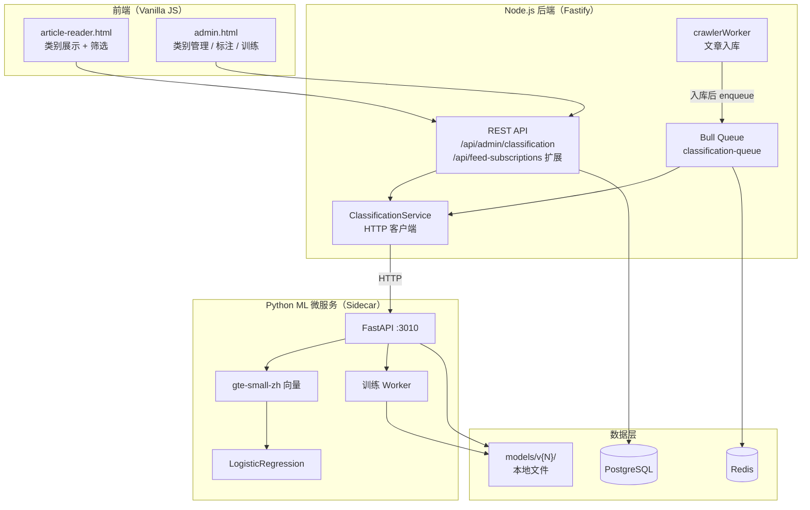
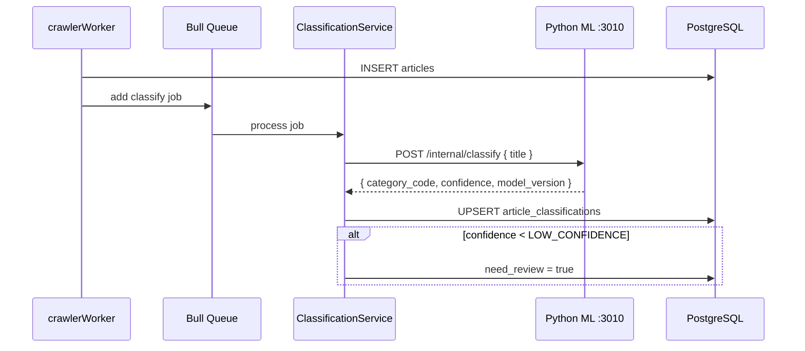
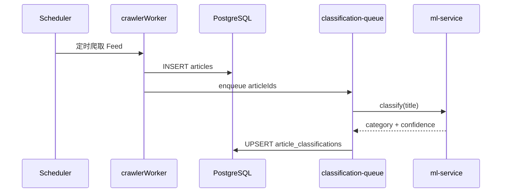

# 新闻标题文本分类功能 — 设计文档

> **项目路径**：`/www/wwwroot/pro`（FeedGen）  
> **参考架构**：`/www/wwwroot/keyatten/docs/ARCHITECTURE.md`  
> **文档版本**：v1.0  
> **更新日期**：2026-06-06  
> **状态**：设计阶段，供后续开发对照

本文档描述 FeedGen 项目中**新闻标题 AI 文本分类**的完整方案，涵盖 ML 推理服务、Node.js 后端、PostgreSQL 数据模型、Bull 异步任务与现有 Vanilla JS 前端。

**分步开发请使用**：[`docs/NEWS_CLASSIFICATION_PROMPTS.md`](./NEWS_CLASSIFICATION_PROMPTS.md)（每次对话执行一个步骤，不建议一次性交给 AI 完成）。

---

## 1. 背景与目标

### 1.1 业务需求

FeedGen 每天通过爬虫从各 Feed 抓取大量新闻标题。用户需要：

| 需求 | 说明 |
|------|------|
| 自动分类 | 新文章入库后，对标题自动打上主题类别（如财经、科技、时政） |
| 动态增类 | 管理员可随时新增类别，无需停机、无需重训大模型 |
| 人工标注 | 管理后台支持单条/批量标注与纠错，积累训练数据 |
| 在线推理 | 单条实时分类 + 批量补跑历史文章 |
| 可训练 | 标注积累后触发训练，分类准确率持续提升 |
| 用户侧筛选 | 阅读器可按 AI 类别筛选文章列表 |

### 1.2 与现有功能的关系

| 功能 | 定位 | 关系 |
|------|------|------|
| **UserTag**（已有） | 用户手动打标，用户级隔离 | **独立并存**；AI 分类不写入 `user_tags` |
| **UserFeedGroup**（已有） | Feed 分组 | 可组合筛选：某分组 + 某 AI 类别 |
| **Article**（已有） | 文章实体 | 分类结果存独立关联表，**不污染** `articles` 表结构 |
| **Crawler Worker**（已有） | 抓取入库 | 入库后触发分类 Bull 任务（扩展点） |

**核心原则**：AI 分类是**系统级、全局共享**的新闻主题类别；UserTag 是**用户级、主观整理**标签。二者 UI 上可相邻展示，数据层严格分离。

### 1.3 环境约束

与 keyatten 参考环境一致（同机部署 ML 服务）：

| 项目 | 约束 |
|------|------|
| CPU | 8 核，无 GPU |
| 内存 | ~8 GB，无 Swap |
| 已有 ML 资源 | `/www/wwwroot/keyatten` 下 `gte-small-zh`、torch CPU、transformers |
| 主栈 | Node.js 18+ / Fastify / Prisma / PostgreSQL / Bull(Redis) |
| 前端 | Vanilla HTML/JS（`article-reader.html`、`admin.html`） |
| 运维 | `feedgen` CLI 管理前后端 |

### 1.4 设计原则（继承 keyatten）

| 原则 | 在本项目的落地 |
|------|----------------|
| 类别与模型解耦 | 类别存 PostgreSQL，分类头为可替换的 sklearn 模型文件 |
| 推理优先速度 | 主力：`gte-small-zh` 向量 + LogisticRegression，单条 < 200ms |
| 训练优先轻量 | CPU 上 3～10 分钟完成一次训练 |
| 新类即时上线 | 新增类别 + 示例标题 → 原型向量冷启动，立即可分类 |
| 训练异步化 | Bull 队列 + Python Worker，不阻塞 API |
| 版本可回滚 | `classification_model_versions` 表 + 文件系统 `models/v{N}/` |

### 1.5 不采用的方案

| 方案 | 原因 |
|------|------|
| 在 Node.js 内嵌 transformers/onnx | 生态弱、内存管理差、与现有 Python 资源重复 |
| 固定类别 BERT 微调 | 每加一类需改分类头并重训，无法动态扩展 |
| 纯 LLM（Qwen 0.5B）作唯一方案 | CPU 推理 2～10 秒/条，日处理几千条压力过大 |
| 分类结果写入 `articles.category` 字段 | 与 UserTag 设计哲学冲突，不利于版本追溯与人工纠错 |

---

## 2. 总体架构



### 2.1 核心公式

```
在线推理 = gte-small-zh（Python Sidecar）+ 轻量分类器（快）
冷启动新类 = 类别原型向量（即时）
持续变准 = 人工标注 → Bull 触发训练 → 版本发布（Admin 可观测）
入库联动 = Crawler 入库 → classification-queue → 异步写 article_classifications
```

### 2.2 为何采用 Node + Python 双进程

| 层级 | 选型 | 理由 |
|------|------|------|
| 业务 API / 鉴权 / DB | 现有 Fastify + Prisma | 与 FeedGen 一致，复用 JWT、Admin 校验、Bull |
| ML 推理 / 训练 | Python FastAPI Sidecar | 复用 keyatten 已有 torch/transformers/gte-small-zh |
| 通信 | HTTP（内网 127.0.0.1:3010） | 简单、可独立重启 ML 服务、内存隔离 |
| 任务编排 | Bull（已有） | 与 crawlerWorker 模式一致，无需引入 Celery |

Node 后端**不直接加载** torch 模型，仅通过 `ClassificationService` 调用 Python 服务，避免 8GB 内存下 Node 进程 OOM。

---

## 3. 模块设计

### 3.1 类别管理模块（Admin）

管理员在 `admin.html` 新面板「新闻分类 → 类别管理」中操作。

**类别字段：**

| 字段 | 类型 | 说明 |
|------|------|------|
| id | SERIAL PK | 主键 |
| code | VARCHAR(64) UNIQUE | API 标识，如 `finance` |
| name | VARCHAR(128) | 中文名，如 `财经` |
| description | TEXT | 类别描述，用于冷启动 |
| color | VARCHAR(16) | 前端 chip 颜色，如 `#e67e22` |
| status | VARCHAR(16) | `active` / `disabled` |
| sort_order | INT | 侧栏排序 |
| created_at / updated_at | TIMESTAMP | 时间戳 |

**关联：示例标题**（`news_category_examples`）

**新增类别流程：**

```
Admin POST /api/admin/classification/categories
  → 写入 news_categories
  → 若有 examples，调用 ML Sidecar 计算原型向量
  → 存入 news_category_prototypes（BLOB）
  → 分类立即可用（冷启动模式）
```

### 3.2 分类推理模块

#### 三层分类策略（与 keyatten 一致）

```
1. 有已发布分类器 vN
   → 向量 + LogisticRegression 预测（主路径）

2. 置信度 < HIGH_CONFIDENCE（默认 0.65）
   → 与各类别原型向量余弦相似度（冷启动 / 新类）

3. 仍 < LOW_CONFIDENCE（默认 0.50）
   → need_review = true，进入 Admin 待标注队列
   → 可选：Qwen-0.5B 兜底（默认关闭）
```

#### 触发时机

| 场景 | 触发方式 |
|------|----------|
| 爬虫新文章入库 | `crawlerWorker` 入库成功后 `classificationQueue.add({ articleId })` |
| 历史文章补跑 | Admin「批量分类」→ Bull 批量任务 |
| 手动单条 | Admin 或内部 API `POST /classify` |
| 用户打开文章（可选） | 若尚无分类结果且启用 lazy classify，异步补跑 |

#### 单条推理时序



### 3.3 人工标注模块（Admin）

**功能清单：**

| 功能 | 说明 |
|------|------|
| 待标注队列 | 低置信度 / 未分类 / 需纠错条目 |
| 单条标注 | 选择类别并提交 |
| 批量标注 | 勾选多条，统一设置类别 |
| 快捷筛选 | 按 Feed、日期、预测类别、置信度、need_review |
| 标注统计 | 每类已标注数量、今日标注量 |
| 纠错回流 | 人工改标写入 `classification_annotations`，供训练使用 |

**界面示意（admin.html 新 Panel）：**

```
┌─────────────────────────────────────────────────────────────┐
│  待标注 (328)  │  已标注 (12,450)  │  类别管理  │  模型训练  │
├─────────────────────────────────────────────────────────────┤
│ 标题                              │ Feed │ AI预测 │ 置信度 │ 操作 │
│ 央行宣布下调存款准备金率...         │ 新浪 │ 财经   │ 0.92  │ [标注]│
│ 国务院印发人工智能产业...           │ 澎湃 │ 科技   │ 0.61  │ [标注]│
│ 某无人机公司获亿元融资...           │ 36氪 │ 未分类  │ 0.38  │ [标注]│
└─────────────────────────────────────────────────────────────┘
```

### 3.4 训练模块

#### 触发方式

| 方式 | 条件 |
|------|------|
| 手动触发 | Admin 点击「开始训练」 |
| 自动触发（可选） | 新增标注 ≥ 200 条，或每周 cron |

#### 训练流程

```
输入：classification_annotations 全量（或增量）

步骤 1 [0%→60%]：ML Sidecar 批量提取 gte-small-zh 向量
步骤 2 [60%→90%]：训练 LogisticRegression
步骤 3 [90%→100%]：验证集评估 accuracy、macro-F1、per-class 指标
步骤 4：保存 models/v{N}/classifier.pkl + metrics.json
步骤 5：Admin 审核后「发布」为 active 版本
```

**进度推送**：复用现有 `ws` 依赖，Admin 页 WebSocket `/api/admin/classification/ws/training/:jobId`；或轮询 `GET .../training/jobs/:id`（MVP 可先轮询）。

#### Bull 队列

| 队列名 | 用途 |
|--------|------|
| `classification-queue` | 单条/小批量文章分类 |
| `classification-batch-queue` | 大批量补跑（限并发） |
| `classification-train-queue` | 训练任务（单并发，避免 OOM） |

---

## 4. 数据库设计（Prisma）

以下模型追加到 `backend/prisma/schema.prisma`，通过 migration 部署。

### 4.1 表结构

```prisma
/// 新闻主题类别（系统级，Admin 管理）
model NewsCategory {
  id          Int      @id @default(autoincrement())
  code        String   @unique @db.VarChar(64)
  name        String   @db.VarChar(128)
  description String?  @db.Text
  color       String?  @db.VarChar(16)
  status      String   @default("active") @db.VarChar(16)
  sort_order  Int      @default(0)
  created_at  DateTime @default(now()) @db.Timestamp(6)
  updated_at  DateTime @default(now()) @db.Timestamp(6)

  examples       NewsCategoryExample[]
  prototype      NewsCategoryPrototype?
  classifications ArticleClassification[]
  annotations    ClassificationAnnotation[]

  @@index([status, sort_order], map: "idx_news_categories_status_sort")
  @@map("news_categories")
}

/// 类别示例标题（冷启动）
model NewsCategoryExample {
  id          Int          @id @default(autoincrement())
  category_id Int
  title       String       @db.Text
  created_at  DateTime     @default(now()) @db.Timestamp(6)
  category    NewsCategory @relation(fields: [category_id], references: [id], onDelete: Cascade)

  @@index([category_id], map: "idx_news_category_examples_category")
  @@map("news_category_examples")
}

/// 类别原型向量（冷启动兜底）
model NewsCategoryPrototype {
  id             Int          @id @default(autoincrement())
  category_id    Int          @unique
  embedding      Bytes        /// numpy float32 序列化
  example_count  Int          @default(0)
  updated_at     DateTime     @default(now()) @db.Timestamp(6)
  category       NewsCategory @relation(fields: [category_id], references: [id], onDelete: Cascade)

  @@map("news_category_prototypes")
}

/// 文章 AI 分类结果（每篇文章保留最新一条，历史可扩展）
model ArticleClassification {
  id              Int           @id @default(autoincrement())
  article_id      Int           @unique
  category_id     Int?
  confidence      Float?
  model_version   String?       @db.VarChar(32)
  need_review     Boolean       @default(false)
  classified_at   DateTime      @default(now()) @db.Timestamp(6)
  article         Article       @relation(fields: [article_id], references: [id], onDelete: Cascade)
  category        NewsCategory? @relation(fields: [category_id], references: [id], onDelete: SetNull)

  @@index([category_id], map: "idx_article_classifications_category")
  @@index([need_review, classified_at(sort: Desc)], map: "idx_article_classifications_review")
  @@map("article_classifications")
}

/// 人工标注记录（训练数据核心）
model ClassificationAnnotation {
  id              Int          @id @default(autoincrement())
  article_id      Int
  category_id     Int
  labeled_by      Int?         /// users.id，null 表示系统导入
  source          String       @default("manual") @db.VarChar(20) /// manual | corrected | imported
  model_version   String?      @db.VarChar(32)
  created_at      DateTime     @default(now()) @db.Timestamp(6)
  article         Article      @relation(fields: [article_id], references: [id], onDelete: Cascade)
  category        NewsCategory @relation(fields: [category_id], references: [id], onDelete: Cascade)
  labeled_by_user User?        @relation(fields: [labeled_by], references: [id], onDelete: SetNull)

  @@index([category_id], map: "idx_classification_annotations_category")
  @@index([article_id, created_at(sort: Desc)], map: "idx_classification_annotations_article")
  @@map("classification_annotations")
}

/// 训练任务
model ClassificationTrainingJob {
  id               Int       @id @default(autoincrement())
  status           String    @default("pending") @db.VarChar(16)
  progress         Int       @default(0)
  stage            String?   @db.VarChar(32)
  train_count      Int?
  val_count        Int?
  category_count   Int?
  trigger_reason   String?   @db.VarChar(128)
  metrics_json     String?   @db.Text
  model_version    String?   @db.VarChar(32)
  error_msg        String?   @db.Text
  started_at       DateTime? @db.Timestamp(6)
  finished_at      DateTime? @db.Timestamp(6)
  created_at       DateTime  @default(now()) @db.Timestamp(6)

  @@index([status, created_at(sort: Desc)], map: "idx_classification_training_jobs_status")
  @@map("classification_training_jobs")
}

/// 模型版本
model ClassificationModelVersion {
  id          Int      @id @default(autoincrement())
  version     String   @unique @db.VarChar(32)
  path        String   @db.Text
  metrics     String?  @db.Text
  is_active   Boolean  @default(false)
  created_at  DateTime @default(now()) @db.Timestamp(6)

  @@map("classification_model_versions")
}
```

### 4.2 Article / User 关系扩展

```prisma
model Article {
  // ... 现有字段 ...
  classification  ArticleClassification?
  classification_annotations ClassificationAnnotation[]
}

model User {
  // ... 现有字段 ...
  classification_annotations ClassificationAnnotation[]
}
```

### 4.3 与 UserTag 对比

| 维度 | UserTag | NewsCategory（AI 分类） |
|------|---------|-------------------------|
| 归属 | 用户级 | 系统级（全局） |
| 管理入口 | 用户阅读器 | Admin 后台 |
| 来源 | 手动（一期） | AI 自动 + Admin 纠错 |
| 关联表 | `user_article_tags` | `article_classifications` |
| 是否改 articles 表 | 否 | 否 |
| 列表筛选参数 | `tagId` | `categoryId` 或 `categoryCode` |

---

## 5. Python ML 微服务设计

### 5.1 目录结构

```
/www/wwwroot/pro/ml-service/
├── app/
│   ├── main.py              # FastAPI 入口，监听 3010
│   ├── config.py            # 模型路径、阈值、keyatten 环境
│   ├── services/
│   │   ├── embedder.py      # gte-small-zh 封装
│   │   ├── classifier.py    # 推理：LR + 原型兜底
│   │   ├── prototype.py     # 原型向量计算
│   │   └── trainer.py       # 训练 + 进度回调
│   └── models/              # Pydantic 请求/响应
├── data/                    # 运行时缓存（可选）
├── requirements.txt         # 继承 keyatten 依赖
├── run.sh                   # 启动脚本
└── README.md
```

**依赖复用**：优先使用 `/www/wwwroot/keyatten/miniconda` 或 venv 中的 torch/transformers，通过 `run.sh` 激活环境，避免重复下载模型。

### 5.2 内部 API（仅 127.0.0.1，不对公网暴露）

| 接口 | 方法 | 用途 |
|------|------|------|
| `/internal/classify` | POST | 单条分类 `{ title }` |
| `/internal/classify/batch` | POST | 批量 `{ items: [{id, title}] }` |
| `/internal/embed` | POST | 批量向量（训练用） |
| `/internal/prototype/rebuild` | POST | 重建某类别原型向量 |
| `/internal/train` | POST | 启动训练 `{ job_id, annotations[] }` |
| `/internal/train/{job_id}/progress` | GET | 训练进度 |
| `/internal/health` | GET | 健康检查 + 当前 active 模型版本 |
| `/internal/reload-model` | POST | 热加载新 published 模型 |

**安全**：Fastify 调用时带 `X-Internal-Token`（环境变量 `ML_SERVICE_TOKEN`），Nginx 不反代 3010 端口。

### 5.3 配置项

| 环境变量 | 默认值 | 说明 |
|----------|--------|------|
| `ML_SERVICE_PORT` | `3010` | 监听端口 |
| `ML_SERVICE_TOKEN` | （必填） | 内部鉴权 |
| `ML_MODELS_DIR` | `/www/wwwroot/pro/ml-service/models` | 模型文件目录 |
| `ML_HIGH_CONFIDENCE` | `0.65` | 高置信阈值 |
| `ML_LOW_CONFIDENCE` | `0.50` | 低置信 / 进人工队列 |
| `ML_EMBED_BATCH_SIZE` | `32` | 向量批大小 |
| `KEYATTEN_VENV` | `/www/wwwroot/keyatten/miniconda` | Python 环境路径 |

### 5.4 内存预算

| 组件 | 预估占用 |
|------|----------|
| gte-small-zh（Python 进程） | ~0.5 GB |
| Fastify + Node + PostgreSQL + Redis | ~1.5 GB |
| 训练峰值（Python） | ~2 GB |
| 爬虫 Playwright（已有） | ~1～2 GB |
| **建议** | ML 服务独立进程；训练时 `classification-train-queue`  concurrency=1 |

---

## 6. Node.js 后端 API 设计

### 6.1 路由注册

在 `backend/src/server.ts` 新增：

```typescript
server.register(classificationAdminRoutes, { prefix: '/api/admin/classification' });
server.register(classificationPublicRoutes, { prefix: '/api/classification' }); // 可选只读
```

用户侧扩展仍在 `feed-subscription.ts`（与 `tagId` 并列）。

### 6.2 Admin API（需 `is_admin`）

前缀：`/api/admin/classification`

#### 类别 CRUD

| 接口 | 方法 | 说明 |
|------|------|------|
| `/categories` | GET | 列表（含示例数、原型是否就绪） |
| `/categories` | POST | 新增 `{ code, name, description, color, examples[] }` |
| `/categories/:id` | PATCH | 更新 |
| `/categories/:id` | DELETE | 禁用（status=disabled） |
| `/categories/:id/examples` | POST | 追加示例标题并重建原型 |

#### 标注

| 接口 | 方法 | 说明 |
|------|------|------|
| `/pending` | GET | 待标注队列 `?need_review=true&limit&offset` |
| `/annotate` | POST | 单条/批量 `{ article_ids[], category_id }` |
| `/stats` | GET | 各类标注量、待审核数 |

#### 分类操作

| 接口 | 方法 | 说明 |
|------|------|------|
| `/classify` | POST | 手动对指定 article_id 重新分类 |
| `/classify/batch` | POST | 提交批量补跑 `{ feed_id?, since?, article_ids? }` |
| `/classify/batch/:jobId` | GET | Bull 任务进度 |

#### 训练与模型

| 接口 | 方法 | 说明 |
|------|------|------|
| `/training/start` | POST | 手动触发训练 |
| `/training/jobs` | GET | 训练历史 |
| `/training/jobs/:id` | GET | 任务详情 + metrics |
| `/models/active` | GET | 当前线上模型 |
| `/models/active` | PUT | 发布指定版本 `{ version }` |
| `/ws/training/:jobId` | WS | 训练进度（P2） |

### 6.3 用户侧 API 扩展

前缀：`/api/feed-subscriptions`（现有 JWT 鉴权）

#### `GET /articles` 扩展

**响应字段（每条 article）**：

```json
{
  "id": 100,
  "title": "央行宣布下调存款准备金率",
  "ai_category": {
    "id": 2,
    "code": "finance",
    "name": "财经",
    "color": "#e67e22",
    "confidence": 0.94,
    "need_review": false
  },
  "tags": []
}
```

无分类时 `ai_category: null`。

**查询参数**：

| 参数 | 说明 |
|------|------|
| `categoryId` | 按 AI 类别筛选（与 `tagId`、`scope=liked` 可组合，需在实现中定义优先级） |
| `categoryCode` | 按 code 筛选（可选） |
| `needReview` | Admin 专用或调试（用户侧默认不可见） |

#### `GET /categories`（用户只读）

返回 active 类别列表，供阅读器侧栏渲染（无需 Admin 权限）。

### 6.4 核心服务类

```
backend/src/services/classification/
├── classificationService.ts   # 调 ML Sidecar、写 DB
├── classificationQueue.ts     # Bull 队列定义与 processor
├── categoryService.ts         # 类别 CRUD + 原型触发
├── annotationService.ts       # 标注逻辑
└── trainingService.ts         # 训练任务编排
```

**`ClassificationService.classifyArticle(articleId)`** 伪代码：

```typescript
async classifyArticle(articleId: number) {
  const article = await prisma.article.findUnique({ where: { id: articleId } });
  if (!article?.title) return;

  const result = await mlClient.classify(article.title);
  await prisma.articleClassification.upsert({
    where: { article_id: articleId },
    create: {
      article_id: articleId,
      category_id: result.categoryId,
      confidence: result.confidence,
      model_version: result.modelVersion,
      need_review: result.confidence < LOW_CONFIDENCE,
    },
    update: { /* 同上 */ },
  });
}
```

### 6.5 Crawler 集成点

在 `backend/src/workers/crawlerWorker.ts` 文章批量入库成功后：

```typescript
// 现有 insert 逻辑之后
if (process.env.CLASSIFICATION_ENABLED !== '0') {
  for (const row of insertedRows) {
    await classificationQueue.add(
      { articleId: row.id },
      { removeOnComplete: 100, attempts: 3, backoff: { type: 'exponential', delay: 2000 } }
    );
  }
}
```

可通过 `CLASSIFICATION_ENABLED=0` 关闭，便于低配环境或调试。

---

## 7. 前端设计

### 7.1 文件规划

| 文件 | 改动 |
|------|------|
| `frontend/admin.html` | 新增侧边菜单：类别管理、待标注、模型训练 |
| `frontend/admin-classification.js` | Admin 分类模块（新建） |
| `frontend/article-reader.html` | 侧栏增加「主题分类」区 |
| `frontend/article-reader.js` | 展示 `ai_category` chip、按 categoryId 筛选 |
| `frontend/styles.css` | 分类 chip 样式（可复用 tag chip） |

### 7.2 阅读器（article-reader）

**列表卡片**：
- 标题下展示 AI 类别 chip（色点 + 名称），与用户 Tag chip 分行或分组展示
- AI chip 样式：`ai-category-chip`，与用户 `tag-chip` 区分（如带机器人图标）

**侧栏**：
- Feed 分组树下方增加「主题分类」折叠区
- `GET /api/classification/categories` 或 feed-subscriptions 扩展端点
- 点击：`activeCategoryId = id`，请求 `GET /articles?categoryId=...`
- 与 `tagId`、`scope=liked` 互斥规则参考 TAG_FEATURE.md

**状态持久化**：
- localStorage 扩展 `activeCategoryId`、`activeScope: 'category'`

### 7.3 管理后台（admin）

**Panel 1 — 类别管理**：
- 表格：code、name、status、示例数、操作（编辑/禁用）
- 新建弹窗：名称、code、描述、颜色、示例标题（多行输入）

**Panel 2 — 待标注队列**：
- 表格：标题、Feed、预测类别、置信度、时间
- 行内下拉改类别 → `POST /annotate`
- 批量勾选 + 统一设类

**Panel 3 — 模型训练**：
- 当前 active 版本、历史版本列表、metrics 摘要
- 「开始训练」按钮、进度条（轮询或 WebSocket）
- 「发布版本」确认对话框

### 7.4 UI 示意（阅读器列表项）

```
┌──────────────────────────────────────────────┐
│ 央行宣布下调存款准备金率0.5个百分点              │
│ [🤖 财经 94%]  [AI] [待读]                    │  ← AI 类别 + 用户 Tag
│ 2 小时前 · 新浪财经                           │
└──────────────────────────────────────────────┘
```

---

## 8. 业务流程

### 8.1 日常自动分类



### 8.2 新类别生命周期

```
Day 1: Admin 新增「低空经济」+ 3 条示例
  → 原型向量就绪，API 可分类（冷启动）

Day 1-7: Admin 标注 50～100 条低置信度文章
  → classification_annotations 积累

Day 7: Admin 触发训练
  → v2 发布，「低空经济」纳入 LR 分类器

持续: 每周或新增标注 > 200 自动重训
```

### 8.3 人工纠错与再训练

```
用户/Admin 发现分类错误
  → POST /annotate 更正
  → 写入 classification_annotations (source=corrected)
  → 更新 article_classifications
  → 达阈值后训练任务纳入新标签
```

---

## 9. 建议初始类别

| code | name | color |
|------|------|-------|
| politics | 时政 | `#c0392b` |
| finance | 财经 | `#e67e22` |
| tech | 科技 | `#2980b9` |
| society | 社会 | `#27ae60` |
| sports | 体育 | `#8e44ad` |
| entertainment | 娱乐 | `#e91e63` |
| international | 国际 | `#16a085` |
| health | 健康 | `#1abc9c` |

Seed 脚本：`backend/prisma/seed-classification.js`（P0 可选）。

---

## 10. 分阶段实施计划

| 阶段 | 周期 | 交付物 | 验收标准 |
|------|------|--------|----------|
| **P0 基础** | 1～2 周 | Prisma migration、ML Sidecar 骨架、类别 Admin API、单条分类 API、原型冷启动 | Admin 可增类；手动 classify 返回结果 |
| **P1 入库联动** | 1 周 | Bull queue、crawlerWorker 钩子、article_classifications 写入 | 新文章自动分类 |
| **P2 标注** | 1 周 | 待标注队列 API、Admin 标注页 | 可人工标注并入库 |
| **P3 训练** | 1～2 周 | 训练 Worker、模型版本表、发布/回滚 | 可训练并切换版本 |
| **P4 用户侧** | 1 周 | 阅读器 ai_category 展示、categoryId 筛选 | 用户可按主题浏览 |
| **P5 生产** | 1 周 | 批量补跑、监控、feedgen 集成 ml-service | 日处理几千条稳定 |
| **P6 增强** | 可选 | 自动触发训练、统计报表、Tag 联动（AI 建议转 UserTag） | 运维自动化 |

**推荐开发顺序**：P0 → P1 → P2 → P4（MVP 可用户可见）→ P3 → P5 → P6。

与 AI 分步提示词的对应关系见 [`NEWS_CLASSIFICATION_PROMPTS.md`](./NEWS_CLASSIFICATION_PROMPTS.md) 文末「推荐执行顺序」。

---

## 11. 运维与部署

### 11.1 feedgen 扩展（建议）

在 `scripts/feedgen` 中增加 ml-service 管理：

| 命令 | 说明 |
|------|------|
| `feedgen start ml` | 启动 Python ML 服务 |
| `feedgen restart ml` | 重启 ML 服务 |
| `feedgen status` | 展示 backend / frontend / ml 状态 |
| `feedgen logs ml -f` | ML 服务日志 |

 systemd 单元示例：`feedgen-ml.service`，WorkingDirectory=`/www/wwwroot/pro/ml-service`。

### 11.2 部署检查清单

```bash
# 1. 数据库迁移
cd /www/wwwroot/pro/backend && npm run db:migrate && npm run db:generate

# 2. 启动 ML 服务
cd /www/wwwroot/pro/ml-service && ./run.sh

# 3. 重启后端（加载新路由与队列）
feedgen restart backend

# 4. 验证
curl -s http://127.0.0.1:3010/internal/health
curl -s -H "Authorization: Bearer $ADMIN_TOKEN" \
  http://127.0.0.1:3000/api/admin/classification/categories
```

### 11.3 环境变量（backend `.env` 追加）

```env
CLASSIFICATION_ENABLED=1
ML_SERVICE_URL=http://127.0.0.1:3010
ML_SERVICE_TOKEN=your-internal-token
ML_HIGH_CONFIDENCE=0.65
ML_LOW_CONFIDENCE=0.50
```

---

## 12. 风险与应对

| 风险 | 应对 |
|------|------|
| 8G 内存 OOM | ML 独立进程；训练单并发；爬虫与训练错峰 |
| transformers 版本冲突 | 固定 keyatten 环境，ML 服务单独 venv |
| ML 服务宕机 | Node 队列任务失败重试；分类失败不阻塞爬虫入库 |
| 相似类别混淆 | 增加标注量、补充示例标题、细化 description |
| 新类冷启动准确率低 | 要求每新类至少 3～5 条示例标题 |
| 与 UserTag 概念混淆 | UI 分区展示；文档与字段命名区分 `ai_category` vs `tags` |

---

## 13. 测试要点

### 13.1 API 冒烟

```bash
export API_BASE="http://127.0.0.1:3000/api"
export ADMIN_TOKEN="<管理员 JWT>"

# 类别列表
curl -s -H "Authorization: Bearer $ADMIN_TOKEN" \
  "$API_BASE/admin/classification/categories"

# 单条分类
curl -s -X POST -H "Authorization: Bearer $ADMIN_TOKEN" \
  -H "Content-Type: application/json" \
  -d '{"article_id": 1}' \
  "$API_BASE/admin/classification/classify"
```

### 13.2 集成测试场景

| 场景 | 预期 |
|------|------|
| 爬虫入库 10 条新文章 | 5 分钟内均有 `article_classifications` 记录 |
| 新增类别 + 3 示例 | 含相关关键词标题置信度 > 0.5 |
| 人工改标 100 条后训练 | 新版本 macro-F1 ≥ 旧版本 |
| ML 服务停止 | 爬虫正常，分类任务进入 failed 可重试 |

---

## 14. 参考文件

| 文件 | 用途 |
|------|------|
| `/www/wwwroot/keyatten/docs/ARCHITECTURE.md` | ML 方案与算法决策来源 |
| `docs/TAG_FEATURE.md` | 用户 Tag 边界、API 风格参考 |
| `backend/prisma/schema.prisma` | 现有数据模型 |
| `backend/src/workers/crawlerWorker.ts` | 入库钩子扩展点 |
| `backend/src/routes/admin.ts` | Admin 鉴权模式 |
| `backend/src/routes/feed-subscription.ts` | 用户文章列表扩展点 |
| `frontend/admin.html` / `article-reader.js` | 前端扩展点 |
| `docs/SERVICE.md` | feedgen 运维规范 |
| `docs/NEWS_CLASSIFICATION_PROMPTS.md` | 分步 AI 开发提示词（Composer 按步执行） |

---

*本文档为 FeedGen 新闻标题分类功能的架构基准；开发过程中如有变更须同步更新此文件、对应 migration 及 PROMPTS 文档。*
