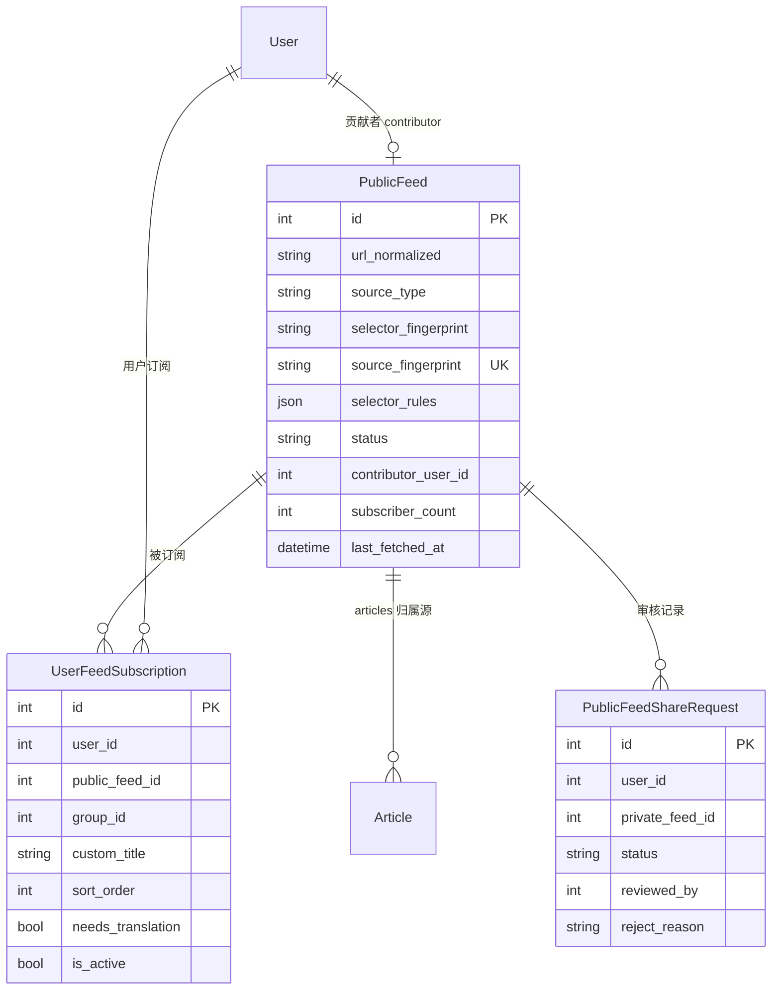
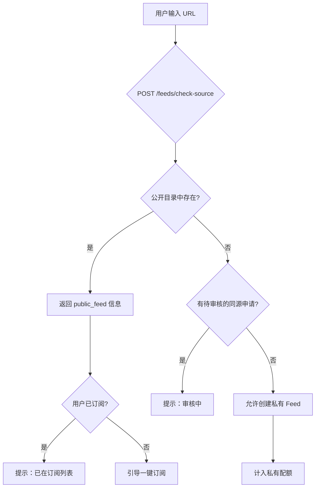
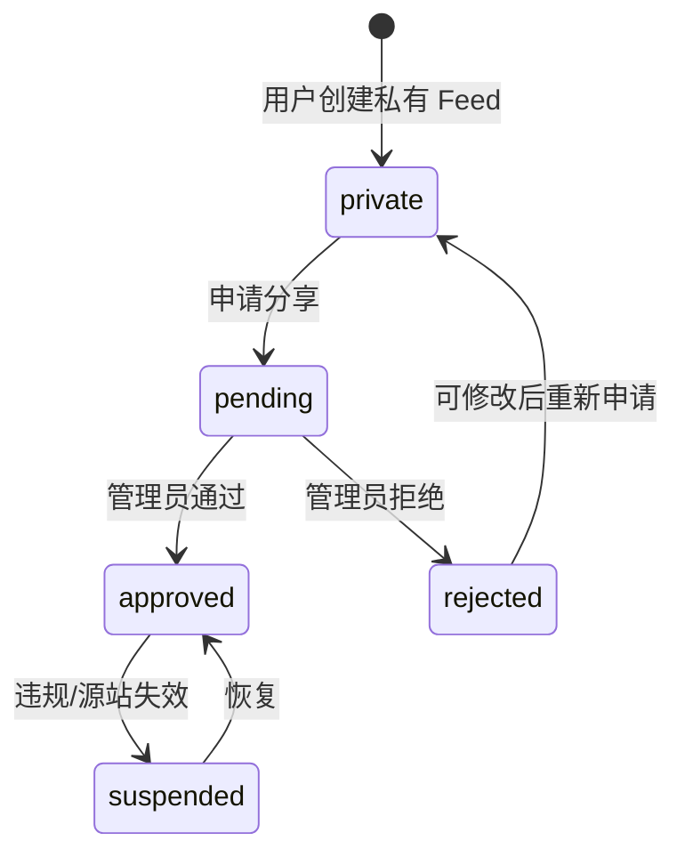

# 公开 Feed 共享与去重订阅机制

本文档描述 FeedGen 多用户场景下的**公开 Feed 目录、分享审核、URL 去重订阅**产品边界、数据模型、业务流程与商业模式，供开发与产品对照。

**文档版本**：1.0  
**状态**：设计稿（未实施）  
**关联代码**：`backend/prisma/schema.prisma`、`backend/src/routes/feed.ts`、`backend/src/routes/feed-subscription.ts`、`backend/src/routes/admin.ts`

---

## 1. 背景与目标

### 1.1 现状

- 每个用户通过 `feeds` 表维护自己的 Feed，`articles` 挂在 `feed_id` 下。
- `source_type` 区分 RSS（`native`）与可视化爬虫（`parsed`）。
- 会员套餐通过 `membership_plan_configs.max_feeds` 限制用户 Feed 数量。
- 已有 `users.is_admin` 与 `/admin` 管理接口。

### 1.2 问题

多用户各自添加相同 URL 的 Feed 或爬虫时，平台会**重复爬取**同一源站，造成：

- 爬虫资源与代理成本浪费
- 目标站压力增大、反爬风险上升
- 用户重复配置、体验割裂

### 1.3 目标

| 目标 | 说明 |
|------|------|
| **爬取唯一性** | 全平台对同一「源指纹」只运行一个爬虫任务 |
| **订阅轻量化** | 用户订阅不复制文章，只建立引用关系 |
| **贡献可追溯** | 首次成功分享者记为 Contributor，与激励挂钩 |
| **审核可控** | 用户申请分享 → 管理员审核 → 全平台公开 |
| **添加时去重** | 新建 Feed/爬虫前检测公开目录，命中则引导订阅 |

### 1.4 设计铁律

1. 全平台对同一源指纹只爬一次。
2. 用户订阅公开源不复制 `articles` 数据。
3. 分享须管理员审核通过后方可进入公开目录。
4. 敏感字段（如 `auth_cookie`）永不进入公开源配置。

---

## 2. 核心概念

| 概念 | 说明 |
|------|------|
| **私有 Feed** | 用户自建、自行爬取的 Feed（现有 `feeds` 行为） |
| **公开源（Public Feed）** | 审核通过后进入全平台目录的 canonical 源，全局单任务爬取 |
| **用户订阅（Subscription）** | 用户对公开源的引用，含分组、排序、翻译等个人偏好 |
| **源指纹（Source Fingerprint）** | URL + 规则规范化后的唯一哈希，用于去重 |
| **贡献者（Contributor）** | 首个通过审核、使该源进入公开目录的用户 |

---

## 3. 数据模型

### 3.1 总体关系

采用 **「源 Feed + 用户订阅」** 双层结构，在现有 schema 上扩展，尽量少动 `articles` 归属逻辑。



### 3.2 与现有 `feeds` 表的策略（推荐：渐进式）

| 表 | 职责 |
|----|------|
| `feeds`（现有） | 用户**私有** Feed（`public_feed_id IS NULL`），继续自爬 |
| `public_feeds`（新） | 审核通过的**公开源**，文章归属此表 |
| `user_feed_subscriptions`（新） | 用户对公开源的订阅，含分组、排序、翻译偏好 |

`articles` 表扩展：

```sql
ALTER TABLE articles ADD COLUMN public_feed_id INT REFERENCES public_feeds(id);
-- 公开源文章：public_feed_id 有值
-- 私有源文章：feed_id 有值（迁移期可并存，逐步归一）
```

长期可选方案：将 `feeds` 统一为用户视图层，`canonical_feed_id` 指向 `public_feeds`（二期重构）。

### 3.3 新表：`public_feeds`

| 字段 | 类型 | 说明 |
|------|------|------|
| `id` | SERIAL PK | |
| `title` | VARCHAR(255) | 展示标题（审核时可由管理员修订） |
| `description` | TEXT | 源描述 |
| `url` | VARCHAR(500) | 原始 URL |
| `url_normalized` | VARCHAR(500) | 规范化 URL（索引） |
| `source_type` | VARCHAR(20) | `native` \| `parsed` |
| `selector_rules` | JSONB | 可视化爬虫规则（`parsed` 专用） |
| `selector_fingerprint` | VARCHAR(64) | 选择器规则哈希（`parsed` 专用） |
| `source_fingerprint` | VARCHAR(64) UNIQUE | 全局去重键 |
| `feed_type` | VARCHAR(50) | 默认 `rss` |
| `favicon_url` | VARCHAR(2000) | |
| `update_interval` | INT | 抓取间隔（秒） |
| `use_proxy` | BOOLEAN | 是否走代理 |
| `anti_bot_status` | VARCHAR(32) | 反爬状态 |
| `requires_auth` | BOOLEAN | 是否需订阅者自备 Cookie |
| `status` | VARCHAR(20) | `approved` \| `suspended` |
| `verified` | BOOLEAN | 管理员认证优质源 |
| `contributor_user_id` | INT FK → users | 贡献者，可 NULL（用户删号后） |
| `subscriber_count` | INT | 订阅人数缓存 |
| `last_fetched_at` | TIMESTAMP | |
| `created_at` | TIMESTAMP | |
| `updated_at` | TIMESTAMP | |

索引：

- `UNIQUE (source_fingerprint)`
- `INDEX (status, subscriber_count DESC)` — 公开目录排序
- `INDEX (url_normalized)` — URL 前缀检索

### 3.4 新表：`user_feed_subscriptions`

| 字段 | 类型 | 说明 |
|------|------|------|
| `id` | SERIAL PK | |
| `user_id` | INT FK → users | |
| `public_feed_id` | INT FK → public_feeds | |
| `group_id` | INT FK → user_feed_groups | 可 NULL（未分组） |
| `custom_title` | VARCHAR(255) | 用户自定义显示名，可 NULL |
| `sort_order` | INT | 用户侧排序 |
| `needs_translation` | BOOLEAN | 个人翻译偏好 |
| `is_active` | BOOLEAN | 用户可暂停订阅 |
| `created_at` | TIMESTAMP | |
| `updated_at` | TIMESTAMP | |

约束：

- `UNIQUE (user_id, public_feed_id)` — 同一用户不可重复订阅同一公开源

### 3.5 新表：`public_feed_share_requests`

| 字段 | 类型 | 说明 |
|------|------|------|
| `id` | SERIAL PK | |
| `user_id` | INT FK → users | 申请人 |
| `private_feed_id` | INT FK → feeds | 待分享的私有 Feed |
| `status` | VARCHAR(20) | `pending` \| `approved` \| `rejected` |
| `reviewed_by` | INT FK → users | 审核管理员 |
| `reject_reason` | TEXT | 拒绝原因 |
| `submitted_at` | TIMESTAMP | |
| `reviewed_at` | TIMESTAMP | |

约束：

- 每用户每月申请次数限制（业务层，建议 ≤ 5）
- 同一 `private_feed_id` 同时只能有一条 `pending` 记录

---

## 4. 源指纹（Source Fingerprint）

仅靠 URL 不足以去重，可视化爬虫还需比对选择器规则。

### 4.1 规范化规则

**URL 规范化（`url_normalized`）：**

- 去除首尾空白
- scheme 统一（`http` → `https`，若目标支持）
- host 小写
- 去除默认端口
- 去除 tracking 参数（`utm_*`、`fbclid` 等）
- 去除末尾 `/`（路径根除外）
- 对 RSS：`/feed`、`/rss` 等等价路径需业务层维护别名表（可选）

**选择器规范化（`parsed`）：**

- JSON 键排序
- 去除空白与注释
- 统一属性选择器写法

### 4.2 指纹算法（伪代码）

```typescript
function buildSourceFingerprint(input: {
  url: string;
  source_type: 'native' | 'parsed';
  selector_rules?: object;
}): string {
  const urlNorm = normalizeUrl(input.url);

  if (input.source_type === 'native') {
    return sha256(`native:${urlNorm}`);
  }

  const rulesCanon = canonicalizeSelectorRules(input.selector_rules);
  return sha256(`parsed:${urlNorm}:${rulesCanon}`);
}
```

| 类型 | 指纹组成 | 示例 |
|------|----------|------|
| RSS / Atom（`native`） | `normalizeUrl(url)` | `https://example.com/feed.xml` |
| 可视化爬虫（`parsed`） | `url + selector_rules 哈希` | 同页不同选择器 = 不同源 |

`public_feeds.source_fingerprint` 设 **唯一索引**，从数据库层杜绝重复公开源。

---

## 5. 业务流程

### 5.1 添加 Feed / 爬虫（前置校验）



**API：**

```
POST /api/feeds/check-source
Body: { url, source_type, selector_rules? }

Response:
{
  "match": "public" | "pending" | "none",
  "public_feed": { id, title, subscriber_count, last_fetched_at, ... },
  "pending_request": { id, submitted_at },
  "already_subscribed": boolean
}
```

**前端交互：**

| `match` 值 | 行为 |
|------------|------|
| `public` | 弹窗：「该源已被维护，已有 N 人订阅，是否直接订阅？」 |
| `pending` | 「同源申请审核中，通过后将通知您」 |
| `none` | 正常进入添加流程 |

**后端强制规则：**

- 创建私有 Feed 时，若 `check-source` 返回 `public`，**拒绝创建**。
- 例外：超级会员可传 `force_private=true` 强制私有（竞品监控等场景）。

### 5.2 分享申请 → 管理员审核 → 公开



**分享前置条件：**

| 条件 | 说明 |
|------|------|
| Feed 归属当前用户 | `feeds.user_id = 当前用户` |
| 稳定运行 ≥ 7 天或成功抓取 ≥ 10 次 | 防垃圾源 |
| 最近 30 天成功率 ≥ 80% | 基于 `crawler_task_histories` |
| 登录态/付费墙源须标注 | 管理员重点审核 |
| 不含敏感字段 | `auth_cookie` 等不进入 `public_feeds` |

**审核通过时系统动作（事务内）：**

1. 查 `source_fingerprint` 是否已有 `public_feed`：
   - **有** → 合并到已有公开源，用户 Feed 转为订阅
   - **无** → 新建 `public_feed`，迁移 `articles` 到 `public_feed_id`
2. 创建 `user_feed_subscriptions`（贡献者自动订阅）
3. 停用该用户私有爬虫任务（`feeds.is_active = false` 或删除私有 feed）
4. 记录 `contributor_user_id`，`subscriber_count++`
5. 通知申请人及等待同源的用户

**审核拒绝：**

- 记录 `reject_reason`
- 私有 Feed 保持不变，用户可修改后重新申请

### 5.3 用户订阅公开 Feed

```
POST /api/subscriptions
Body: { public_feed_id, group_id?, custom_title?, needs_translation? }

DELETE /api/subscriptions/:id
```

- 不占用或按折扣占用「私有爬虫配额」（见第 7 节）
- 文章读取：`user_feed_subscriptions` → `public_feeds` → `articles WHERE public_feed_id = ?`
- 用户态数据（已读、喜欢、标签）仍走 `user_article_reads`、`user_article_likes`、`user_article_tags`，通过 `article_id` 关联

### 5.4 爬虫调度改造

**现状：** 按各用户 `feeds` 逐条调度。

**改造后：**

```
调度队列 =
  SELECT public_feeds WHERE status = 'approved' AND is_active = true
  UNION
  SELECT feeds WHERE public_feed_id IS NULL AND is_active = true  -- 私有源
```

| 源类型 | 调度策略 |
|--------|----------|
| 公开源 | 全局单任务；间隔取 `max(平台最小间隔, 订阅人数加权间隔)` |
| 私有源 | 仍按用户套餐 `min_fetch_interval` 限制 |

---

## 6. 权限与安全

| 场景 | 规则 |
|------|------|
| 公开源 `selector_rules` | 普通用户只读；不允许修改 |
| `auth_cookie` | 永不写入 `public_feeds`；需登录源标记 `requires_auth=true`，订阅者自行配置 |
| 文章 `content` | 按会员 `history_days` 裁剪可见范围 |
| 恶意刷分享 | 每用户每月最多 5 次申请；同 fingerprint 拒绝重复 pending |
| 违规下架 | `status = suspended` 后停止爬取；已订阅用户收到通知 |
| 强制私有 | 仅超级会员；用于竞品监控、内部系统 |

---

## 7. 商业模式

结合现有三档套餐（免费 30 / 普通 200 / 超级 1000 feeds），将配额拆为两个维度。

### 7.1 配额模型

| 套餐 | 公开源订阅数 | 私有爬虫数 | 说明 |
|------|-------------|-----------|------|
| 免费版 | 30 | 3 | 鼓励用公开目录，限制自建 |
| 普通会员 | 200 | 20 | 大部分需求通过订阅解决 |
| 超级会员 | 1000 | 100 | 可 `force_private` 绕过公开源 |

**计费逻辑：**

```javascript
// 订阅公开源：不计入或半计入 max_feeds（推荐：公开订阅不占配额）
// 私有爬虫：计 1
effective_feed_count = private_feeds + Math.floor(public_subscriptions * 0.5)
```

公开订阅不占配额可提升目录使用率，降低平台爬虫成本。

### 7.2 贡献者激励（飞轮）

| 机制 | 说明 |
|------|------|
| 贡献徽章 | 公开源详情页展示「由 @user 贡献」 |
| 订阅分成 | 每新增 10 个订阅 → 贡献者获得 7 天普通会员延期（或积分） |
| 优质源认证 | 管理员标记 `verified=true`，目录置顶 |
| 贡献排行榜 | 月榜前 10 送超级会员体验 |

激励路径：分享 → 目录丰富 → 新用户少重复爬取 → 成本下降 → 补贴贡献者。

### 7.3 增值服务

| 产品 | 定价思路 | 价值 |
|------|----------|------|
| 公开源市场 Pro 包 | ¥29/月 | 订阅数不限 + 优先抓取队列 |
| 私有源强制模式 | 仅超级会员 | 竞品监控、不想公开的配置 |
| 高频公开源 | 按源 ¥5/月 | `update_interval` 降至 5 分钟 |
| 翻译加成 | 按文章量 | 公开源 + 用户 `needs_translation` 时按量计费 |
| 企业团队席 | ¥1999/年 | 共享订阅列表、统一审核转公开 |
| API 导出 | 按调用量 | 公开源 RSS 对外输出（B2B） |

### 7.4 成本锚点

假设单源日均爬取成本约 ¥0.05（代理 + 浏览器）：

- 100 用户各爬同一源 ≈ ¥5/天
- 合并为 1 个公开源 ≈ ¥0.05/天
- **节省约 99%** → 支撑「公开订阅免费不占配额」策略

---

## 8. API 清单

### 8.1 用户端

| 方法 | 路径 | 说明 |
|------|------|------|
| POST | `/api/feeds/check-source` | 添加前检测公开目录 |
| POST | `/api/feeds/:id/share-request` | 申请分享私有 Feed |
| GET | `/api/feeds/:id/share-request` | 查询当前 Feed 分享状态 |
| GET | `/api/public-feeds` | 公开目录（搜索、排序） |
| GET | `/api/public-feeds/:id` | 公开源详情 |
| POST | `/api/subscriptions` | 订阅公开源 |
| DELETE | `/api/subscriptions/:id` | 取消订阅 |
| GET | `/api/subscriptions` | 我的订阅列表（可与现有 feed-subscriptions 合并展示） |
| GET | `/api/users/me/contributions` | 我的贡献统计 |

### 8.2 管理端（`/admin`，需 `is_admin`）

| 方法 | 路径 | 说明 |
|------|------|------|
| GET | `/admin/public-feed-requests` | 待审/历史申请列表 |
| POST | `/admin/public-feed-requests/:id/approve` | 通过 |
| POST | `/admin/public-feed-requests/:id/reject` | 拒绝 `{ reason }` |
| GET | `/admin/public-feeds` | 全量公开源 |
| PATCH | `/admin/public-feeds/:id` | _suspend、调间隔、认证等_ |

---

## 9. 前端模块

| 页面/组件 | 功能 |
|-----------|------|
| 添加 Feed 向导 | URL 输入后实时 `check-source`；命中则展示订阅卡片 |
| Feed 详情 | 「申请公开分享」+ 审核状态展示 |
| 公开目录 | 搜索、分类、订阅数、最近更新、贡献者 |
| 订阅管理 | 公开订阅与私有 Feed 统一列表（图标区分来源） |
| 管理后台 | 审核队列、健康度、一键通过/拒绝 |

---

## 10. 边界情况

| 情况 | 处理 |
|------|------|
| 两人几乎同时申请同一源 | `source_fingerprint` 唯一约束；先审先得，后者合并 |
| 公开源爬取持续失败 | `anti_bot_status` 升级；通知贡献者；连续失败自动 `suspended` |
| 用户取消订阅后再添加同 URL | 走订阅流程，不重建私有源 |
| 贡献者删号 | `contributor_user_id` 置 NULL；公开源由平台继续维护 |
| `parsed` 规则微调 | 新 fingerprint，需重新审核；管理员可手动合并规则版本 |
| 用户已有私有 Feed 转公开 | 分享申请通过后迁移文章，不丢历史 |
| 公开源已存在时用户申请分享 | 审核通过即转为订阅已有公开源，不新建 |

---

## 11. 分阶段实施

| 阶段 | 周期 | 交付 |
|------|------|------|
| **Phase 1** | 约 2 周 | `public_feeds` 表 + `check-source` + 订阅公开源（只读文章） |
| **Phase 2** | 约 2 周 | 分享申请 + 管理审核 + 爬虫调度去重 |
| **Phase 3** | 约 1 周 | 配额拆分、贡献激励、公开目录页 |
| **Phase 4** | 持续 | 企业版、API 变现、规则合并工具 |

### Phase 1 最小可交付

1. Prisma migration：`public_feeds`、`user_feed_subscriptions`
2. `POST /api/feeds/check-source`
3. `POST /api/subscriptions` + 文章列表支持 `public_feed_id` 路径
4. 添加 Feed 前端：命中公开源时拦截并引导订阅

### Phase 2 依赖 Phase 1

1. `public_feed_share_requests` 表
2. 分享申请与审核 API
3. `crawlerWorker` 按 `public_feed_id` 去重调度
4. 审核通过后文章迁移脚本

---

## 12. 与现有代码衔接

| 现有能力 | 用途 |
|----------|------|
| `Feed.source_type`（`native` / `parsed`） | 指纹策略分支 |
| `Feed.selector_rules` | `parsed` 指纹输入 |
| `CrawlerTaskHistory` | 分享前置稳定性校验 |
| `User.is_admin` + `/admin` | 审核后台 |
| `membership_plan_configs` | 扩展 `max_private_feeds` / `max_public_subscriptions` |
| `feed-subscription.ts` Feed 上限错误 | 区分私有/订阅配额提示 |

---

## 13. 非目标（一期不做）

- 公开源的用户间评论/评分
- 自动化审核（仅人工 + 规则校验）
- 跨实例联邦公开目录
- 贡献者现金提现（一期仅积分/会员延期）

---

**文档维护**：实施各 Phase 后请更新本文「状态」与各 API 的实际路径，并补充迁移脚本说明。
